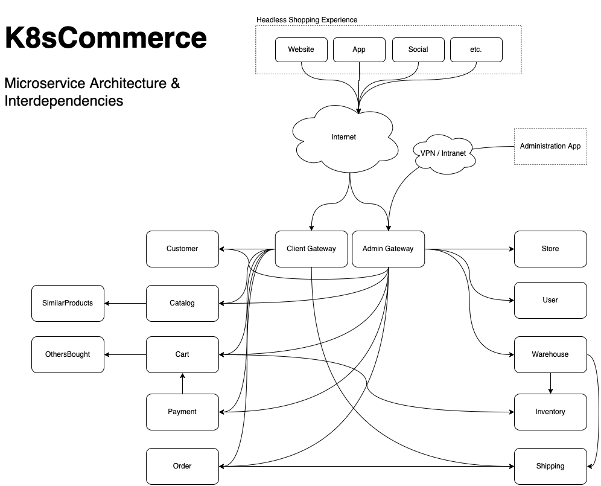

# K8sCommerce - Golang, Kubernetes & Cloud Native Ecommerce

K8sCommerce is a microservice based ecommerce platform written in [Go](https://go.dev/) designed specifically for kubernetes.

Checkout our [kubernetes operator]().

## Service Overview


## Getting Started

K8sCommerce can be run multipe ways:

- **Local single-node kubernetes kind cluster:** Recommended for evaluating K8sCommerce - [instructions]()

- **Deployment to your existing cluster:** Recommended for testing & production - [intructions]()

- **Running Clusterless:** Recommended for local development - [intructions]() 


### Quick Start
Deployment to a k8s cluster using the K8sCommerce Operator.

```sh
# Install RabbitMQ Operator for messaging
kubectl apply -f https://github.com/rabbitmq/cluster-operator/releases/latest/download/cluster-operator.yml

# Install K8sCommerce Operator
kubectl apply -f 
```

## Tools, tools, and tools

To eliminate human errors and speed up development we use tools to create common code. See 

- **protobuf** (microservice generation): 

- **Go-Zero / goctl** (microservice generation): 

    We use tools as often as possible to reduce repitively writing the same code over and over again. We have incorporated the [go-zero](https://github.com/zeromicro/go-zero) framework for this reason. Using their built-in goctl tool the "boiler-plate" code is generated using modifyable go-templates, leaving the work of adding business logic remaining. 

- **xo** (database model generation):


# Headless Commerce 