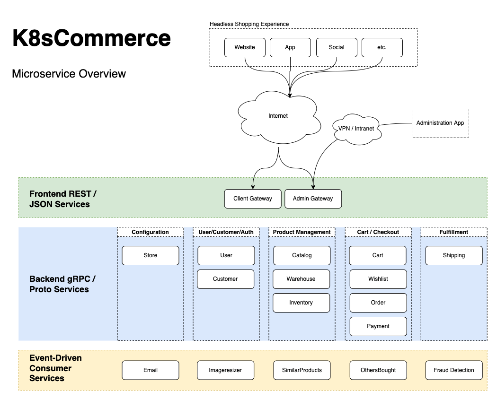

# K8sCommerce - Cloud Native Ecommerce

<!-- ALL-CONTRIBUTORS-BADGE:START - Do not remove or modify this section -->

<!-- ALL-CONTRIBUTORS-BADGE:END -->

K8sCommerce is in active development! The goal is to create a cloud native microservice-based ecommerce platform written in [Go](https://go.dev/)—for kubernetes deployments.

Project status: in active development / **pre-alpha**

## Documentation

Documentation is in active development at [k8scommerce.com](https://k8scommerce.com/).

## Project Origin

K8sCommerce began as a personal project of [localrivet](https://github.com/localrivet).

## Service Overview

## Development Progress

The following shows what has been completed and what is yet to be done:

| Service          |    DB Table(s)     |       .proto       |        .api        |       logic        | tests | release |
| ---------------- | :----------------: | :----------------: | :----------------: | :----------------: | :---: | :-----: |
| Cart             | :white_check_mark: | :white_check_mark: | :white_check_mark: | :white_check_mark: | some  |  alpha  |
| Catalog          | :white_check_mark: | :white_check_mark: | :white_check_mark: | :white_check_mark: | some  |  alpha  |
| Customer         | :white_check_mark: | :white_check_mark: | :white_check_mark: | :white_check_mark: | some  |  alpha  |
| Email            | :white_check_mark: | :white_check_mark: | :white_check_mark: | :white_check_mark: | some  |  alpha  |
| Imageresizer     | :white_check_mark: | :white_check_mark: | :white_check_mark: | :white_check_mark: | some  |  alpha  |
| Inventory        | :white_check_mark: | :white_check_mark: |                    |                    |       |    -    |
| Others Bought    |         -          | :white_check_mark: |                    |                    |       |    -    |
| Payment          | :white_check_mark: | :white_check_mark: | :white_check_mark: |                    |       |    -    |
| Shipping         |         -          | :white_check_mark: |                    |                    |       |    -    |
| Similar Products | :white_check_mark: | :white_check_mark: |                    |                    |       |    -    |
| Store            | :white_check_mark: | :white_check_mark: | :white_check_mark: |                    |       |    -    |
| User             | :white_check_mark: | :white_check_mark: | :white_check_mark: | :white_check_mark: |       |  alpha  |
| Warehouse        |         -          | :white_check_mark: |                    |                    |       |    -    |
| Wishlist         |         -          |         -          |                    |                    |       |    -    |

# Microservice Types

There are three types of microservices use in this project.

- Frontend / Client - These services are web-facing services via a REST/JSON.
  - Admin API - Contains all admin endpoints and is a separate service from the client.
  - Client API - Contains all the client endpoints used in ecommerce stores.
- Backend RPC - These communicate to the frontend/client services via gRPC / protobufs.
  - Cart
  - Catalog
  - Customer
  - Inventory
  - Payment
  - Shipping
  - Store
  - User
  - Warehouse
- Consumer - These services listen for specific events via RabbitMQ that can be run in the background.
  - Email
  - Imageresizer
  - Others Bought
  - Similar Products

## Kubernetes Operator

Checkout our [kubernetes operator](https://github.com/k8scommerce/cluster-operator).

## Contributors ✨

Would you like to contribute? We need help in the following areas:

- Coding
- Testing
- Documentation
- Promotion
- Administration Development
- Kubernetes
- Terraform
- GitOps
- Etc.

Thanks goes to these wonderful people ([emoji key](https://allcontributors.org/docs/en/emoji-key)):

<!-- ALL-CONTRIBUTORS-LIST:START - Do not remove or modify this section -->
<!-- prettier-ignore-start -->
<!-- markdownlint-disable -->
<table>
  <tr>
    <td align="center"><a href="https://github.com/localrivet"> <b>localrivet</b></a> <a href="#infra-localrivet" title="Infrastructure (Hosting, Build-Tools, etc)">🚇</a> <a href="https://github.com/k8scommerce/k8scommerce/commits?author=localrivet" title="Code">💻</a> <a href="https://github.com/k8scommerce/k8scommerce/commits?author=localrivet" title="Documentation">📖</a> <a href="https://github.com/k8scommerce/k8scommerce/commits?author=localrivet" title="Tests">⚠️</a> <a href="#maintenance-localrivet" title="Maintenance">🚧</a> <a href="#content-localrivet" title="Content">🖋</a></td>
  </tr>
</table>

<!-- markdownlint-restore -->
<!-- prettier-ignore-end -->

<!-- ALL-CONTRIBUTORS-LIST:END -->

This project follows the [all-contributors](https://github.com/all-contributors/all-contributors) specification. Contributions of any kind welcome!
